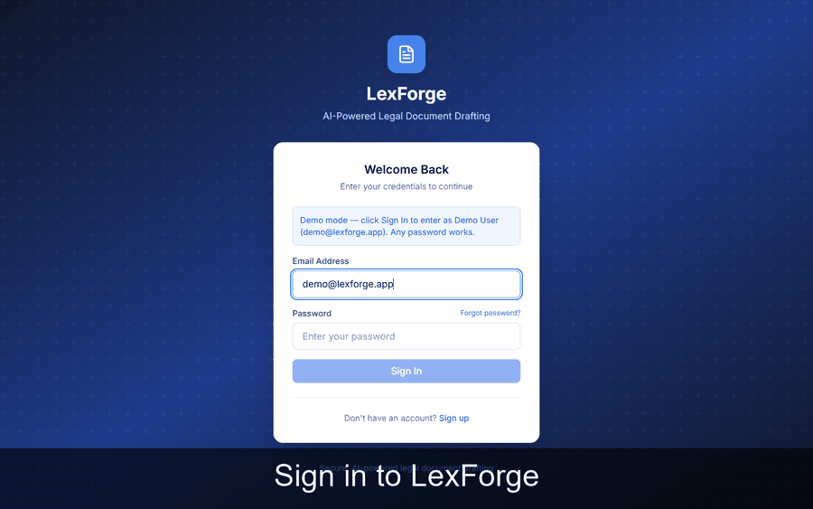

# LexForge

**AI-powered demand-letter drafting for law firms** — draft, collaborate on, and format legal demand letters with AI-assisted argument building, a reusable clause library, and court-rules-aware formatting.

[](https://github.com/franciszver/lexforge/actions/workflows/ci.yml)
**781 tests** · React 19 · TypeScript · Node/Express · Render

> **Live demo:** [lexforge-demo.onrender.com](https://lexforge-demo.onrender.com) — demo mode: sign in with any email/password. Documents and clauses are bundled fixture data; AI suggestions are live (OpenRouter free-tier models via the API's rate-limited endpoint — the first call after idle may take ~30–60s while the free-tier server wakes).



*Walkthrough: sign in, browse drafts, edit in the legal editor, insert from the clause library, add Bluebook-formatted citations, apply AI suggestions, and review the audit trail.*

## Features

- **AI argument builder** — generate structured legal arguments (introduction, numbered arguments, conclusion) from case facts, with AI suggestions to strengthen weak points
- **AI clause suggestions** — context-aware clause recommendations while drafting
- **Clause library** — reusable, categorized clauses with usage tracking and one-click insertion
- **Citation manager** — format and insert legal citations (Bluebook-style formatting)
- **Court-rules formatting** — brief & pleading formatting driven by a court-rules database (margins, captions, line numbering per jurisdiction)
- **Real-time collaboration** — live cursors, selections, and presence sync across editors; document sharing with role-based invitations and revocable share links
- **Audit logging** — every document event recorded and reportable, built for legal-compliance review

## Tech stack

| Layer | Technology |
|---|---|
| Frontend | React 19, TypeScript, Vite, Redux Toolkit, Tiptap (ProseMirror), Tailwind CSS |
| API server | Node.js, Express, JWT auth, Socket.IO (real-time) |
| Database | PostgreSQL via Prisma ORM, hosted on Neon |
| AI | OpenRouter, called from the server's AI generate endpoint |
| Hosting | Render — static site (frontend) + web service (API) |
| Testing | Vitest + Testing Library (frontend), Vitest + Supertest (server) — 781 tests across 57 files |

## Architecture

```
┌─────────────────────────────────────────────┐
│  React SPA (Vite + Redux Toolkit + Tiptap)  │
│  editor · clause library · citations · args │
└──────────────┬──────────────────────────────┘
               │ VITE_API_URL (REST + WebSocket)
               ▼
┌───────────────────────────────────────────────┐
│  API server (Node/Express)                     │
│  auth (JWT) · REST data · AI generate · Socket.IO │
└──────────────┬──────────────────────┬─────────┘
               │                      │
               ▼                      ▼
       ┌───────────────┐      ┌──────────────┐
       │ Postgres (Neon)│      │ OpenRouter   │
       └───────────────┘      └──────────────┘
```

Real-time collaboration rides Socket.IO: presence and cursor updates are throttled client-side and fanned out to all sessions on a document.

## Live demo

The hosted demo (**demo mode**) serves bundled fixture data — no database and no real accounts — while AI suggestions call the live API (free-tier models, rate-limited and capped). Sign in with any email and password to explore the full UI.

## Local setup

```bash
git clone https://github.com/franciszver/lexforge.git
cd lexforge
npm install
VITE_DEMO_MODE=1 npm run dev   # demo mode: fixture data, no backend required
```

To run against a local API server instead:

```bash
cd server
cp .env.example .env   # fill in DATABASE_URL, JWT_SECRET, OPENROUTER_API_KEY
npm install
npx prisma generate
npm run dev
```

```bash
VITE_API_URL=http://localhost:3001 npm run dev
```

Details in [docs/SETUP.md](docs/SETUP.md).

```bash
npx vitest run          # frontend: 541 tests
cd server && npm test   # server: 240 tests
npm run build            # production build
```

## License

MIT — see [LICENSE](LICENSE).
